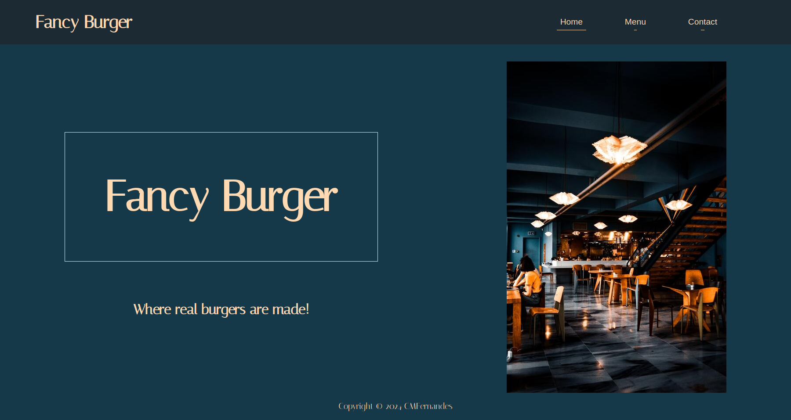

# Restaurant page

:point_right: [live demo](https://cmfernandes.github.io/restaurant-page/) 

---

## About

The primary goal of this project was to develop a multi-page Restaurant website using webpack, focusing on implementing ES6 modules for better code organization and leveraging webpack for bundling assets. 

Additionally, all contents of the website were dynamically rendered.

Topics:
- ES6 modules
- webpack
- DOM manipulation

Assigment from [The Odin Project](https://www.theodinproject.com/lessons/node-path-javascript-restaurant-page#project-solution) Javascript course.